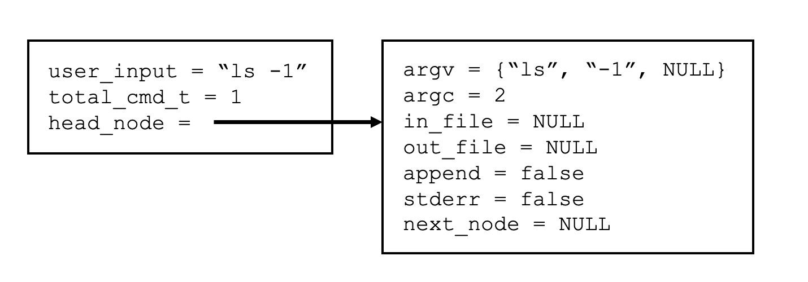
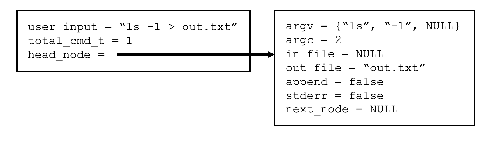
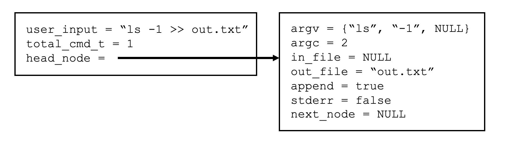
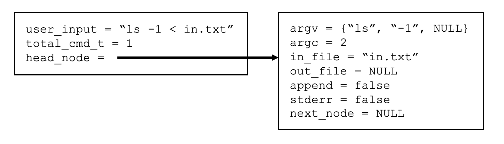
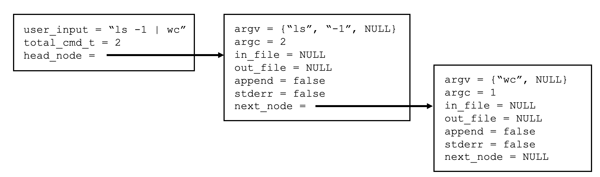
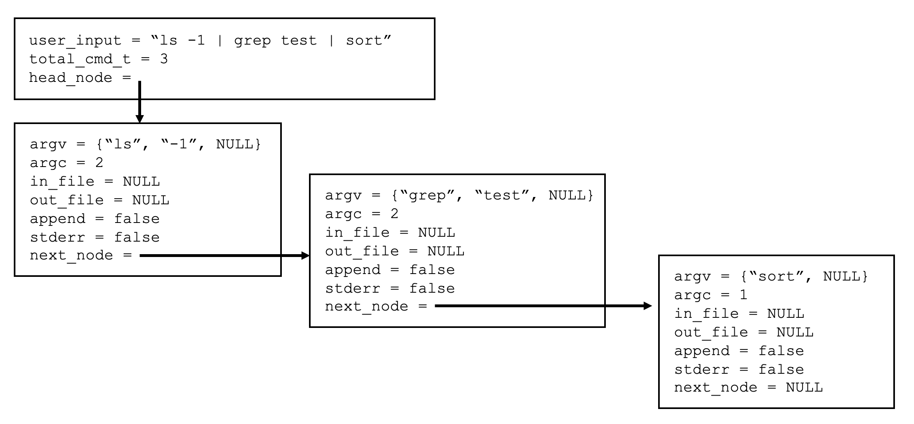

# Bash shell

In this lab, you will deepen your understanding of process control and learn new system concepts that enable communication between processes and allow a process to redirect its input and output. You will explore these ideas by implementing a simple command-line interpreter (a `shell`) for Linux using the C programming language.

Specifically, this lab focuses on the following core concepts:

- Process control  
- Input/Output (I/O) redirection  
- Interprocess communication (IPC)  

This lab has three primary goals:

1. Develop a stronger understanding of how the operating system provides **process control** services that user programs can invoke. Your `shell` will use the three fundamental system calls: `fork()`, `exec()`, and `wait()`.

2. Learn how processes can exchange data using the `pipe()` system call. A **pipe** is a unidirectional communication channel that enables interprocess communication (IPC). In a typical pipeline, the standard output (`stdout`) of one process becomes the standard input (`stdin`) of another process.

3. Understand how a program can **redirect** its input or output using the `dup2()` system call. Every process maintains a file descriptor (`fd`) table, which tracks the sources and destinations of its input and output. Each entry in this table represents an I/O resource, such as `stdin`, `stdout`, `stderr`, a file on the filesystem, or a network socket. The `dup2()` system call allows a process to duplicate and reassign file descriptors, making redirection possible.

## Table of Contents

*   [API references](#api_references)
*   [Policies](#policies)
*   [Background](#background)
*   [Shell](#shell)
*   [Test Harness](#test-harness)
*   [Assignment](#assignment)
*   [Honors Section](#honors-section)
*   [Submission](#submission)

## API references
* [fork](https://man7.org/linux/man-pages/man2/fork.2.html) man page.
* [wait](https://linux.die.net/man/2/waitpid) man page.
* [exec](https://man7.org/linux/man-pages/man3/exec.3.html) man page.
* [open](https://man7.org/linux/man-pages/man2/open.2.html) man page.
* [close](https://man7.org/linux/man-pages/man2/close.2.html) man page.
* [dup2](https://man7.org/linux/man-pages/man2/dup.2.html) man page.
* [pipe](https://man7.org/linux/man-pages/man2/pipe.2.html) man page.

## Policies

### Collaboration

This is a team project, and the assignments are available on this Canvas assignment webpage. Please be welcoming and kind to the students in your team (i.e., be a good classmate).

**You may not change groups or work alone.** Any deviations will result in a zero grade. If you have questions about what is allowed or not, you must ask. Saying later that you didn't understand or were unsure is not an acceptable excuse.

**Collaboration is permitted only within your assigned team.** There may be **no collaboration, discussion, or sharing of work between different teams**. All submitted work must be **entirely the product of your own team**.

To ensure fairness for everyone, the **collaboration policy will be strictly enforced**. Any violation may result in **a zero for all students involved**.

### AI 

AI may not be used to generate a coding solution. Your solution must be your own work. If you have any questions about what is or isn't allowed, you must ask. Saying afterwards that you didn't understand or were unsure is not an acceptable excuse.

To ensure fairness for everyone, the **AI policy will be strictly enforced**. Any violation may result in **a zero for all students involved**.

## Background

### Pipes

Pipes are one of the oldest and simplest forms of interprocess communication (IPC) in Linux. They are supported by all Linux systems and provide a way for processes to send data to one another.

A pipe has two important limitations:

- **Unidirectional (half-duplex):** Data flows in only one direction—from the write end to the read end.  
- **Related processes only:** Pipes can only be used between processes that share a common ancestor (for example, a parent process and its child).

Typically, a parent process creates a pipe before calling `fork()`. When `fork()` is executed, the child process inherits the parent’s file descriptor table. This table includes file descriptors for both ends of the pipe, allowing the parent and child to communicate through it.

A pipe is created using the function:

```c
int pipe(int fd[2]);
```

If the call succeeds, the array fd will contain two file descriptors:
* `fd[0]` — the file descriptor for the **read end** of the pipe.
* `fd[1]` — the file descriptor for the **write end** of the pipe.

Data written to `fd[1]` can be read from `fd[0]`.

It is also important to note that if the child process later calls an `exec` function, the inherited file descriptor table remains intact by default. This means the pipe can still be used after `exec`. Processes should always `close` the read or write end of the pipe if it is not being used, and both ends should be closed when communication is complete to prevent resource leaks and unintended behavior.

Please review the IPC slides and supporting C programs provided on the Canvas [schedule](https://uncch.instructure.com/courses/109159/pages/schedule) for further details and example code.

### Redirection

Redirection allows programs to read from and write to files without being modified, making simple command-line tools far more flexible and reusable. In this lab, you will implement the core mechanisms that enable this behavior in a shell. In this lab, your shell program must implement the following redirection features:
* Redirect standard output to a file (`>`).
* Redirect standard output to a file in append mode (`>>`).
* Redirect a file to standard input (`<`).

**Note**: Correctly manage file descriptors when implementing redirection. Any file descriptor that is not used by the process must be closed (using `close()`). After calling `dup2()`, the original file descriptor returned by `open()` must be closed to avoid resource leaks and unintended behavior.

Below are examples of how these redirections work in a normal Bash shell. These examples are incomplete and is provided for illustration only. Do not copy and paste it directly into your program.

#### Input Redirection (`<`)

If you run the following command in Bash:

```sh
wc -l < Makefile
```
the file `Makefile` is redirected to the standard input (`stdin`) of the `wc` (word count) program. Instead of reading from the keyboard, `wc` reads its input from the file.

In general, input redirection can be implemented using the `open()` and `dup2()` system calls. For example:
```c
int fd = open("Makefile", O_RDONLY);
dup2(fd, STDIN_FILENO);
close(fd);
```
This code opens the file for reading, duplicates the file descriptor so that it replaces `STDIN_FILENO`, and then closes the original file descriptor.

#### Output Redirection (>)

If you run:

```sh
ls -l > out.txt
```

the standard output (`stdout`) of the `ls` program is redirected to the file `out.txt`. If the file does not exist, it is created. If it already exists, it is overwritten (truncated).

In general, this can be implemented using `open()` and `dup2()`:

```c
int fd = open("out.txt", O_WRONLY | O_CREAT | O_TRUNC, 0644);
dup2(fd, STDOUT_FILENO);
close(fd);
```

Here:
* `O_WRONLY` opens the file for writing
* `O_CREAT` creates the file if it does not exist
* `O_TRUNC` clears the file if it already exists
* `0644` sets the file permissions

#### Output Redirection with Append (>>)

If you run:

```sh
ls -l >> out.txt
```

the standard output (`stdout`) of ls is redirected to `out.txt`, but the output is appended to the end of the file instead of overwriting it.

This can be implemented similarly, but using the `O_APPEND` flag:

```c
int fd = open("out.txt", O_WRONLY | O_CREAT | O_APPEND, 0644);
dup2(fd, STDOUT_FILENO);
close(fd);
```
The `O_APPEND` flag ensures that new output is added to the end of the file.


## Shell

A **shell** is a user-level program that reads commands, launches other programs, and connects them to files or to each other. It serves as the interface between the user and the operating system, supporting process creation, input/output redirection, and pipelines.

Shells also support **built-in commands** (builtins), such as `cd`, which run directly inside the shell process because they must modify the shell’s state. For this reason, builtins do not require `fork()`, `exec()`, or `wait()`.

At a high level, the shell algorithm repeatedly performs the following steps:

1. Read a line of `user input` after displaying a prompt (see `Lab02.c` file).
2. Parse the user input into commands, identifying [redirection](#redirection) operators and [pipes](#pipes), and building an [internal representation](#internal-representation).
3. If the command is a builtin, execute it directly in the shell.
4. Otherwise, set up any required pipes and use `fork()` to create one child process per command.
5. In each child, configure redirection and pipe endpoints, close unused file descriptors, then call `execvp()` to run the program.
6. In the parent, close unused file descriptors and wait for the child process(es) to finish.

This loop continues (see `Lab02.c` file) until the user exits the shell by typing `exit`.

Using the provided Makefile, to compile your shell program run:

````
make
````

To execute your shell program run:

````
make run
````

### Internal representation

The `shell.h` header file defines two C struct's used to represent the user input:

```c
typedef struct cmd {
	char** argv;			// Command arguments
	int argc;				// Totatl number of command arguments
	char* in_file;          // Name (or path) of input file when < redirection is used
    char* out_file;         // Name (or path) of output file when > or >> redirection is used
    bool append;    		// True if >> redirection
    bool stderr;			// True if 2> redirection (honors only)
	struct cmd* next_node;	// Next command in the linkedlist
} cmd_t;

typedef struct {
	char* user_input;			// User input
	unsigned int total_cmd_t;	// Total number of commands
	cmd_t* head_node;			// First command in a linkedlist
} input_struct;
```

Below is a brief description of the fields in the `cmd_t` structure:

- `argv` is an array of strings containing the command and its arguments. Redirection symbols (`<`, `>`, `>>`, `2>`) and pipe symbols (`|`) are not included.  
  **Note:** `argv` must be `NULL`-terminated, as required by the [exec](https://man7.org/linux/man-pages/man3/exec.3.html) family of system calls.
- `argc` is the total number of command-line arguments stored in `argv`.
- `in_file` stores the name (or path) of the input file when `<` redirection is used. If no input redirection is specified, this field is `NULL`.
- `out_file` stores the name (or path) of the output file when `>` or `>>` redirection is used. If no output redirection is specified, this field is `NULL`.
- `append` is `true` if `>>` (append redirection) is used; otherwise, it is `false`.
- `stderr` is `true` if `2>` (standard error redirection) is used; otherwise, it is `false`.
- `next_node` points to the next `cmd_t` structure in the linked list (used for pipelines). If there is no next command, this field is `NULL`.

Below is a brief description of the fields in the `input_struct` structure:

- `user_input` stores the raw command-line string entered by the user.
- `total_cmd_t` stores the total number of parsed commands.
- `head_node` points to the first `cmd_t` structure in the linked list of commands. If no valid command is entered, this field is `NULL`.

The following **policies** apply:

- If the user presses Enter without typing a command, `user_input` will be an empty string, `total_cmd_t` will be 0, and `head_node` will be `NULL`.
- If no input redirection is provided, `in_file` will be `NULL`.
- If no output redirection is provided, `out_file` will be `NULL`.
- If there is no next command in a pipeline, `next_node` will be `NULL`.


### Few examples

If the user input is one command:

```sh
ls -l
```
then the internal representation will be:




If the user input is one command with output redirection:

```sh
ls -l > out.txt
```
then the internal representation will be:



If the user input is one command with output redirection and append:

```sh
ls -l >> out.txt
```
then the internal representation will be:



If the user input is one command with input redirection:

```sh
ls -l < in.txt
```
then the internal representation will be:



If the user input is two commands with a pipe:

```sh
ls -l | wc
```
then the internal representation will be:



If the user input is three commands with two pipes:

```sh
ls -l | grep test | sort
```
then the internal representation will be:




## Test Harness

The following files are used to verify the correct operation of your coding solution.

```text
.
|-- testcase.c  	 # Where your teams test cases are defined.
|-- testharness.sh   # A shell script that automates the testing process.
```


### testcase.c

All your test cases are defined as functions in the `testcase.c` file and are used to verify the correct operation of your coding solution when the [shell](#shell) is **not** running. This is where you and your teammates will add your test cases, and you should spend time familiarizing yourselves with the code.

For example:

```c
int tc1() {
    int num_cmds = 0;
    int res = PASS;
    char* user_input = (char*)calloc(CHUNK, sizeof(char));
    strncpy(user_input, "ls -l", CHUNK - 1);
    num_cmds = parse_input( user_input );
    if (num_cmds != 1 ) res = FAIL;
    unallocate_resources();
    free(user_input);
    return res;
}
````

This is an example test case provided in the starter file. This particular test case, named `tc1`, is used to determine whether your `parse_input` function correctly parses a user input string, allocates memory for the [shell](internal-representation), populates the structure fields, and then properly frees that memory using the `unallocate_shell` function. If the test case passes, the function returns `PASS` (or `1`). If the test case fails, the function returns `FAIL` (or `0`). 

**Note:** Remember to update the `fn_table[]` whenever a new test function is added. Simply include the function name as a string and its function pointer (i.e., the function name itself). An example is provided in the starter file.

### testharness.sh

This is a Bash script used to automate the testing process by running your test cases sequentially. You and your teammates should take time to familiarize yourselves with the test harness script.

The test harness can be run directly from the command line:

````
./testharness.sh
````

Alternatively, it can be executed using `make`:

````
make test
````

**Important:** As new [test cases](#testcases.c) are added, the test harness variable `N`, which represents the total number of test cases—must be updated accordingly.


## Assignment

Only the following files can be modified by your team.

```text
.
|-- shell.c          # Refer to the shell section.
|-- testcase.c  	 # Where your teams test cases are defined.
|-- testharness.sh   # A shell script that automates the testing process.
```

The [test harness](#test-harness) section covers the `testcase.c` and `testharness.sh` files.

The `shell.c` file is divided into two parts: functions that **cannot** be modified and functions that **you will** modify. In `shell.c`, you **may not**:

- remove or add functions (including helper functions),
- remove or add global variables, or
- remove or add additional header files.

Additionally, in the `parse_input` and `parse_command` functions, you may **not** use any of the following functions to parse the user input string:

- `strtok`
- `strtok_r`
- `strsep`
- `strcspn`
- `strspn`
- `strpbrk`

In short, you may only use pointer operations to parse the user input.

Failure to follow **any** of the above rules will result in **a zero grade** for you and your teammates on this lab assignment—no exceptions. If you have any questions about what is or is not allowed, you **must** ask. Claiming afterward that you did not understand or were unsure is not an acceptable excuse.

Lastly, all of these files include comments intended to guide you and your teammates. Please read them carefully.

## Honors Section

Students enrolled in the Honors section will modify the `testharness.sh` file to add test cases that verify the following:

- **Memory management:** Determine whether the server program has any memory leaks—that is, confirm that all heap-allocated memory is properly freed (hint: use <a href="https://valgrind.org/docs/manual/manual.html">Valgrind</a>).
- **Process management:** Determine whether the parent process correctly reaps its child processes (hint: inspect process information in the `/proc` filesystem).
- **File descriptor management:** Verify that both the parent and child processes correctly close all file descriptors created for [redirection](#redirection) and [pipe](#pipes) operations. Leaving file descriptors open can cause resource leaks or unexpected behavior. *(Hint: you can inspect process information using the `/proc` filesystem.)*
- **Standard error redirection:** Your shell must support redirecting standard error to a file using `2>`. This works similarly to redirecting standard output with `>`, except that `STDERR_FILENO` is redirected instead of `STDOUT_FILENO`.

You are given a **significant amount of agency** in how you implement these tests. However, you are expected to remain mindful of the AI usage policies. If you have any questions or uncertainties, you **must** ask for clarification. Claiming afterward that you did not understand the requirements is not an acceptable excuse.

When submitting your lab, ensure that your submission includes the revised `testharness.sh` file (and any additional Bash scripts that are invoked by the test harness, if applicable).


## Submission

### Honor code acknowledgement 

Submission of your team’s work signifies that **all team members** acknowledge and understand the [Collaboration](#collaboration) and [AI](#ai) policies.

It is important to note that although each team member will maintain their own GitHub repository, **all repositories must be identical**. This requirement allows us to effectively enforce the collaboration policy. If you have any questions or uncertainties, you **must** ask for clarification. Claiming afterward that you did not understand the submission requirements is not an acceptable excuse.

Follow the same submission process used in **lab00**. If you have questions, attend office hours or create a private Piazza post addressed to all instructors.
